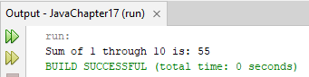

# Java | Lambdas and  Streams

### Topic Notes;

## 1. Fig17_03_StreamReduce

### Example Notes;

* A stream pipeline typically begins with a method call that creates the stream (known as the data source)

* In the following example that is achieved with rangeClosed(start, end) is from the IntStream class and it returns a sequentially ordered IntStream from the start to end values (inclusive). o, the line above will create an ordered sequence of int elements: 1,2,3,4,5,6,7,8,9,10

* The sum() method returns the sum of all the ints in the stream. This processing step is called reduction (it reduces the stream to a single value)

* A terminal operation initiates a stream pipeline’s processing and produces a result. IntStream’s sum() method is a terminal operation.

```
package javachapter17;  
import java.util.stream.IntStream;  // Imports the IntStream class for creating streams of ints

public class Fig17_03_StreamReduce {
    public static void main(String[] args) {
        System.out.printf("Sum of 1 through 10 is: %d%n",
                IntStream.rangeClosed(1, 10) // IntStream.rangeClosed(1, 10) generates a stream of integers from 1 to 10, inclusive
                         .sum()); // The sum() method calculates and returns the sum of all elements in the stream.
    }
}
```




## 2. Fig17_04_StreamMapReduce

```

```

## 3. Fig17_07_StreamFilterMapReduce

```

```

## 4. Fig17_08_RandomIntegers

```

```

## 5. Fig17_09_IntStreamOperations

```

```

## 6. Fig17_11_ArraysAndStreams

```

```

## 7. Fig17_12_ArraysAndStreams2

```

```

## 8. Fig17_13_Employee

```

```

## 9. Fig17_14_ProcessingEmployees

```

```

## 10. Fig17_22_StreamOfLines

```

```

## 11. Fig17_24_RandomIntStream

```

```
