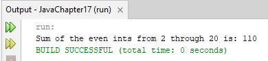
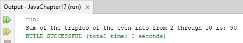
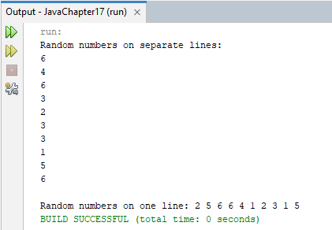
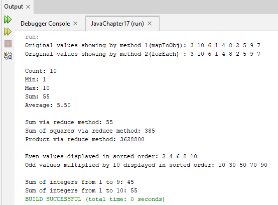
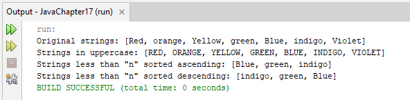
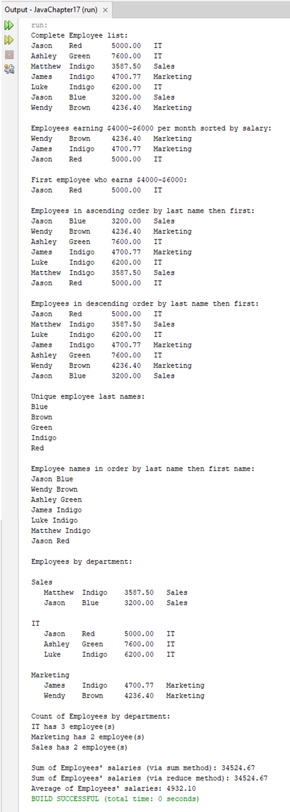
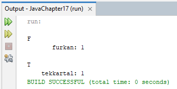
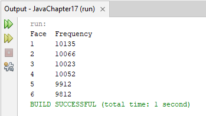

# Java | Lambdas and  Streams

### Topic Notes;

## 1. Fig17_03_StreamReduce

### Example Notes;

* A stream pipeline typically begins with a method call that creates the stream (known as the data source)

* In the following example that is achieved with rangeClosed(start, end) is from the IntStream class and it returns a sequentially ordered IntStream from the start to end values (inclusive). o, the line above will create an ordered sequence of int elements: 1,2,3,4,5,6,7,8,9,10

* The sum() method returns the sum of all the ints in the stream. This processing step is called reduction (it reduces the stream to a single value)

* A terminal operation initiates a stream pipeline’s processing and produces a result. IntStream’s sum() method is a terminal operation.

```
package javachapter17;  
import java.util.stream.IntStream;  // Imports the IntStream class for creating streams of ints

public class Fig17_03_StreamReduce {
    public static void main(String[] args) {
        System.out.printf("Sum of 1 through 10 is: %d%n",
                IntStream.rangeClosed(1, 10) // IntStream.rangeClosed(1, 10) generates a stream of integers from 1 to 10, inclusive
                         .sum()); // The sum() method calculates and returns the sum of all elements in the stream.
    }
}
```


## 2. Fig17_04_StreamMapReduce

```
package javachapter17;
import java.util.stream.IntStream;  // Imports the IntStream class for creating streams of ints

public class Fig17_04_StreamMapReduce {
    public static void main(String[] args) {

        System.out.printf("Sum of the even ints from 2 through 20 is: %d%n",
                IntStream.rangeClosed(1, 10) // Generates a stream of integers from 1 to 10, inclusive
                         .map((int x) -> x * 2) // The map operation transforms each element of the stream by 
                                                // multiplying it by 2. This converts the range 1..10 to the even numbers 2..20
                         .sum());
    }
}
```



## 3. Fig17_07_StreamFilterMapReduce

```
package javachapter17;

// Fig. 17.7: StreamFilterMapReduce.java
// Triple the even ints from 2 through 10 then sum them with IntStream.
import java.util.stream.IntStream;

public class Fig17_07_StreamFilterMapReduce {
    public static void main(String[] args) {
        System.out.printf(
                "Sum of the triples of the even ints from 2 through 10 is: %d%n",
                IntStream.rangeClosed(1, 10) // Generates a stream of integers from 1 to 10, inclusive
                         .filter(x -> x % 2 == 0) // Excludes all odd numbers, leaving only even numbers
                         .map(x -> x * 3) // Triples each element in the filtered stream
                         .sum()); // Calculates and returns the sum of all transformed stream elements
    }
}
```



## 4. Fig17_08_RandomIntegers

```
package javachapter17;

// Fig. 17.8: RandomIntegers.java
// Shifted and scaled random integers.
import java.security.SecureRandom;
import java.util.stream.Collectors;

public class Fig17_08_RandomIntegers {

    public static void main(String[] args) {
        SecureRandom randomNumbers = new SecureRandom(); // Creates an instance of SecureRandom

        System.out.println("Random numbers on separate lines:");
        randomNumbers.ints(10, 1, 7) // Generates 10 random integers between 1 and 6 (inclusive)
                     .forEach(System.out::println); // System.out::println is a method reference, a shortcut for a lambda calling
                                                    // It means that the println method of the System.out object will be called.
                                                    // The compiler converts "System.out::println" to "x->System.out.println(x)"
                                                    // x represents the current stream element

        // Display 10 random integers on the same line
        String numbers = randomNumbers.ints(10, 1, 7) // Generates another set of 10 random integers between 1 and 6
                                      .mapToObj(String::valueOf) // Transforms each integer into its String form, creating a new stream of Strings. 
                                                                 // This is different from the previous map operation(.map(x -> x * 3)), which returned an IntStream. 
                                                                 // Here, mapToObj enables mapping from integers to a stream of reference-type elements.
                                                                 // The compiler converts "String::valueOf" to "x -> String.valueOf(x)"
                                                                 // This lambda function calls valueOf for each integer, converting its String representation.
                                      
                                      .collect(Collectors.joining(" ")); // Concatenate all the Strings with “ “ between each one.
                                                                         // Method collect is a form of reduction because it returns one object (a String)
        /*
            Step-by-Step Execution:
                .ints(...)   : Generate Integers   : [5, 3, 2, 6, 1, 4, 5, 3, 2, 6].
                .mapToObj(..): Map to Strings      : ["5", "3", "2", "6", "1", "4", "5", "3", "2", "6"].
                .collect(
                    Collectors.joining(" "))       : Combine Strings with Spaces : "5 3 2 6 1 4 5 3 2 6".
        */

        System.out.printf("%nRandom numbers on one line: %s%n", numbers); // Prints the concatenated string of numbers
    }
}
```



## 5. Fig17_09_v2_IntStreamOperations

```
package javachapter17;

// Fig. 17.9: IntStreamOperations.java
// Demonstrating IntStream operations.
import java.util.Arrays;
import java.util.stream.Collectors;
import java.util.stream.IntStream;

public class Fig17_09_v2_IntStreamOperations {

    public static void main(String[] args) {
        int[] values = {3, 10, 6, 1, 4, 8, 2, 5, 9, 7};

        // display original values Method 1
        System.out.print("Original values showing by method 1(mapToObj): ");
        System.out.println(
                IntStream.of(values)
                        .mapToObj(String::valueOf) // Transforms each integer into its String form
                        .collect(Collectors.joining(" "))); // Concatenate all the Strings with “ “ between each one.
        
        // display original values Method 2:
        System.out.print("Original values showing by method 2(forEach) : ");
        IntStream.of(values) //: It's a method in the IntStream class. Creates a stream from an array of integers.
                .forEach(value -> System.out.printf("%d ", value)); //: Iterates over each element of the stream and applies the given action.
        
        System.out.println();        

        // count, min, max, sum and average of the values
        System.out.printf("%nCount: %d%n", IntStream.of(values).count()); // output: 10
        System.out.printf("Min: %d%n", IntStream.of(values).min().getAsInt()); // output: 1
        System.out.printf("Max: %d%n", IntStream.of(values).max().getAsInt()); //output: 10
        System.out.printf("Sum: %d%n", IntStream.of(values).sum()); // output: 55
        System.out.printf("Average: %.2f%n", IntStream.of(values).average().getAsDouble()); // output: 5.50

        // sum of values with reduce method
        System.out.printf("%nSum via reduce method: %d%n", IntStream.of(values).reduce(0, (x, y) -> x + y));
        /*
        The reduce() method in this case is called with two parameters: 
              an identity value (0) and 
              a binary operator lambda (x, y) -> x + y. 

        The identity value is the starting point for the reduction and 
        the lambda defines how each pair of elements should be combined.

        Here's how the reduction process will unfold with the array:

        Initial Value (identity): 0

        First pair  :  0 + 3  = 3
        Second pair :  3 + 10 = 13
        Third pair  : 13 + 6  = 19
        Fourth pair : 19 + 1  = 20
        Fifth pair  : 20 + 4  = 24
        Sixth pair  : 24 + 8  = 32
        Seventh pair: 32 + 2  = 34
        Eighth pair : 34 + 5  = 39
        Ninth pair  : 39 + 9  = 48
        Tenth pair  : 48 + 7  = 55
         */

        // sum of squares of values with reduce method
        System.out.printf("Sum of squares via reduce method: %d%n", IntStream.of(values).reduce(0, (x, y) -> x + y * y));
        /*
        This reduce() operation calculates the sum of the squares of each element in the array.

        Reduction Process Explained:
        Initial Value (identity): 0
        Operation               : (x, y) -> x + y * y 
                                where x is the accumulator (keeps the running total) 
                                and y is the current stream element.

        Step-by-Step Calculation:
        Initial State: Start with 0 (identity).
         First Element (3)  : Compute 0   + 3*3   = 0 + 9     = 9.
         Second Element (10): Compute 9   + 10*10 = 9 + 100   = 109.
         Third Element (6)  : Compute 109 + 6*6   = 109 + 36  = 145.
         Fourth Element (1) : Compute 145 + 1*1   = 145 + 1   = 146.
         Fifth Element (4)  : Compute 146 + 4*4   = 146 + 16  = 162.
         Sixth Element (8)  : Compute 162 + 8*8   = 162 + 64  = 226.
         Seventh Element (2): Compute 226 + 2*2   = 226 + 4   = 230.
         Eighth Element (5) : Compute 230 + 5*5   = 230 + 25  = 255.
         Ninth Element (9)  : Compute 255 + 9*9   = 255 + 81  = 336.
         Tenth Element (7)  : Compute 336 + 7*7   = 336 + 49  = 385.     
         */

        // product of values with reduce method
        System.out.printf("Product via reduce method: %d%n", IntStream.of(values).reduce(1, (x, y) -> x * y));
        /*
          Reduction Process(.reduce(1, (x, y) -> x * y)):
      
        Initial State: Start with 1 (identity value for multiplication).
        First Element (3)   : Compute 1      * 3  = 3.
        Second Element (10) : Compute 3      * 10 = 30.
        Third Element (6)   : Compute 30     * 6  = 180.
        Fourth Element (1)  : Compute 180    * 1  = 180
        Fifth Element (4)   : Compute 180    * 4  = 720.
        Sixth Element (8)   : Compute 720    * 8  = 5760.
        Seventh Element (2) : Compute 5760   * 2  = 11520.
        Eighth Element (5)  : Compute 11520  * 5  = 57600.
        Ninth Element (9)   : Compute 57600  * 9  = 518400.
        Tenth Element (7)   : Compute 518400 * 7  = 3628800.
         */

        // even values displayed in sorted order
        System.out.printf("%nEven values displayed in sorted order: ");
        IntStream.of(values)
                .filter(value -> value % 2 == 0)
                .sorted()
                .forEach(value -> System.out.printf("%d ", value));
        System.out.println();
        /*
Step-by-Step Execution
    Create Stream   : {3, 10, 6, 1, 4, 8, 2, 5, 9, 7}.
    Filter Even Nums : {10, 6, 4, 8, 2}.
    Sort Stream     : {2, 4, 6, 8, 10}.
    Print Each      : 2 4 6 8 10       
         */
        // odd values multiplied by 10 and displayed in sorted order
        System.out.printf("Odd values multiplied by 10 displayed in sorted order: ");
        IntStream.of(values)
                .filter(value -> value % 2 != 0)
                .map(value -> value * 10)
                .sorted()
                .forEach(value -> System.out.printf("%d ", value));
        System.out.println();
        /*
Step-by-Step Execution
    Create Stream   : {3, 10, 6, 1, 4, 8, 2, 5, 9, 7}.
    Filter Odd Nums : {3, 1, 5, 9, 7}.
    Multiply by 10  : {30, 10, 50, 90, 70}.
    Sort Stream     : {10, 30, 50, 70, 90}.
    Print Each      : 10 30 50 70 90       
         */
        // sum range of integers from 1 to 10, exlusive
        System.out.printf("%nSum of integers from 1 to 9: %d%n",
                IntStream.range(1, 10).sum());
        // IntStream    : {3, 10, 6, 1, 4, 8, 2, 5, 9, 7}.  
        // .range(1, 10): {1, 2, 3, 4, 5, 6, 7, 8, 9}.
        // .sum()       : 45

        // sum range of integers from 1 to 10, inclusive
        System.out.printf("Sum of integers from 1 to 10: %d%n",
                IntStream.rangeClosed(1, 10).sum());
        // IntStream    : {3, 10, 6, 1, 4, 8, 2, 5, 9, 7}.  
        // .range(1, 10): {1, 2, 3, 4, 5, 6, 7, 8, 9, 10}.
        // .sum()       : 55
    }
} // end class IntStreamOperations
```



## 6. Fig17_11_ArraysAndStreams

```
package javachapter17;

// Fig. 17.11: ArraysAndStreams.java
// Demonstrating lambdas and streams with an array of Integers.
import java.util.Arrays;
import java.util.Comparator;
import java.util.List;
import java.util.stream.Collectors;

public class Fig17_11_ArraysAndStreams {

    public static void main(String[] args) {
        Integer[] values = {2, 9, 5, 0, 3, 7, 1, 4, 8, 6};  // Array of Integer values

        // Display original values
        System.out.printf("Original values: %s%n", Arrays.asList(values));  // Converts the array to a List and prints it
        /*
        Arrays.asList(values) : [2, 9, 5, 0, 3, 7, 1, 4, 8, 6]
        */

        // Sort values in ascending order with streams
        System.out.printf("Sorted values: %s%n",
                Arrays.stream(values)  // Creates a stream from the array
                        .sorted()  // Sorts the stream in natural ascending order
                        .collect(Collectors.toList()));  // Collects the results into a List and prints
        /*
        Arrays.stream(values) : {2, 9, 5, 0, 3, 7, 1, 4, 8, 6}
        .sorted(): {0, 1, 2, 3, 4, 5, 6, 7, 8, 9}
        .collect(Collectors.toList()): [0, 1, 2, 3, 4, 5, 6, 7, 8, 9]
        */
        
        // Values greater than 4
        List<Integer> greaterThan4
                = Arrays.stream(values)  // Creates a stream from the array
                        .filter(value -> value > 4)  // Filters stream to include only values greater than 4
                        .collect(Collectors.toList());  // Collects the filtered results into a List
        System.out.printf("Values greater than 4: %s%n", greaterThan4);  // Prints the List
        /*
        Arrays.stream(values) : {2, 9, 5, 0, 3, 7, 1, 4, 8, 6}
        .filter(value -> value > 4): {9, 5, 7, 8, 6}
        .collect(Collectors.toList()): [9, 5, 7, 8, 6]
        */

        // Filter values greater than 4 then sort the results
        System.out.printf("Sorted values greater than 4: %s%n",
                Arrays.stream(values)  // Creates a stream from the array
                        .filter(value -> value > 4)  // Filters stream to include only values greater than 4
                        .sorted()  // Sorts the filtered stream
                        .collect(Collectors.toList()));  // Collects the sorted results into a List and prints
        /*
        Arrays.stream(values) : {2, 9, 5, 0, 3, 7, 1, 4, 8, 6}
        .filter(value -> value > 4): {9, 5, 7, 8, 6}
        .sorted(): {5, 6, 7, 8, 9}
        .collect(Collectors.toList()): [5, 6, 7, 8, 9]
        */

        // GreaterThan4 list sorted with streams
        System.out.printf(
                "Values greater than 4 (ascending with streams): %s%n",
                greaterThan4.stream()  // Creates a stream from the greaterThan4 List
                        .sorted()  // Sorts the stream in natural ascending order
                        .collect(Collectors.toList()));  // Collects the sorted results into a List and prints
        /*
        greaterThan4.stream(): {9, 5, 7, 8, 6}
        .sorted(): {5, 6, 7, 8, 9}
        .collect(Collectors.toList()): [5, 6, 7, 8, 9]
        */
    }
}
```


## 7. Fig17_12_ArraysAndStreams2

### Explanation:

1. The Fig17_12_ArraysAndStreams2 class demonstrates the usage of lambdas and streams with an array of strings.

2. The main method is the entry point of the program.

3. Inside the main method, an array of strings called strings is defined, containing the names of colors: "Red", "orange", "Yellow", "green", "Blue", "indigo", "Violet".

4. The original array of strings is displayed using System.out.printf() and Arrays.asList(strings). This converts the array to a list and prints it in a readable format.

5. The code then demonstrates how to convert all the strings to uppercase using streams:
* Arrays.stream(strings) creates a stream from the strings array.
* .map(String::toUpperCase) applies the toUpperCase() method to each string in the stream using a method reference.
* .collect(Collectors.toList()) collects the uppercase strings into a list.
* The resulting list of uppercase strings is printed using System.out.printf().

6. Next, the code shows how to filter and sort strings that come before the letter "n" (case-insensitive) in ascending order:
* Arrays.stream(strings) creates a stream from the strings array.
* .filter(s -> s.compareToIgnoreCase("n") < 0) filters the strings that come before "n" using a lambda expression. The compareToIgnoreCase() method is used for case-insensitive comparison.
* .sorted(String.CASE_INSENSITIVE_ORDER) sorts the filtered strings in ascending order using a case-insensitive comparator.
* .collect(Collectors.toList()) collects the sorted strings into a list.
* The resulting list of filtered and sorted strings is printed using System.out.printf().

7. Finally, the code demonstrates filtering and sorting strings that come before the letter "n" (case-insensitive) in descending order:
* Arrays.stream(strings) creates a stream from the strings array.
* .filter(s -> s.compareToIgnoreCase("n") < 0) filters the strings that come before "n" using a lambda expression.
* .sorted(String.CASE_INSENSITIVE_ORDER.reversed()) sorts the filtered strings in descending order using a reversed case-insensitive comparator.
* .collect(Collectors.toList()) collects the sorted strings into a list.
* The resulting list of filtered and sorted strings is printed using System.out.printf().

This code showcases the power of streams and lambda expressions in Java 8 and above. It demonstrates how to perform operations like mapping, filtering, and sorting on an array of strings using concise and expressive code. The use of method references (e.g., String::toUpperCase) and lambda expressions (e.g., s -> s.compareToIgnoreCase("n") < 0) makes the code more readable and functional in style.

```
package javachapter17;

// Fig. 17.12: ArraysAndStreams2.java
// Demonstrating lambdas and streams with an array of Strings.
import java.util.Arrays;
import java.util.Comparator;
import java.util.stream.Collectors;

public class Fig17_12_ArraysAndStreams2 {

    public static void main(String[] args) {
        String[] strings = {"Red", "orange", "Yellow", "green", "Blue", "indigo", "Violet"};
        // Original array of strings

        // Display original strings
        System.out.printf("Original strings: %s%n", Arrays.asList(strings));
        /*
        Arrays.asList(strings): ["Red", "orange", "Yellow", "green", "Blue", "indigo", "Violet"]
        */

        // Strings in uppercase
        System.out.printf("Strings in uppercase: %s%n",
                Arrays.stream(strings)  // Creates a stream from the array
                        .map(String::toUpperCase)  // Applies the toUpperCase() method to each string in the stream
                        .collect(Collectors.toList()));  // Collects the uppercase strings into a List and prints
        /*
        Arrays.stream(strings): {"Red", "orange", "Yellow", "green", "Blue", "indigo", "Violet"}
        .map(String::toUpperCase): {"RED", "ORANGE", "YELLOW", "GREEN", "BLUE", "INDIGO", "VIOLET"}
        .collect(Collectors.toList()): ["RED", "ORANGE", "YELLOW", "GREEN", "BLUE", "INDIGO", "VIOLET"]
        */

        // Strings less than "n" (case insensitive) sorted ascending
        System.out.printf("Strings less than \"n\" sorted ascending: %s%n",
                Arrays.stream(strings)  // Creates a stream from the array
                        .filter(s -> s.compareToIgnoreCase("n") < 0)  // Filters strings that come before "n" (case insensitive)
                        .sorted(String.CASE_INSENSITIVE_ORDER)  // Sorts the filtered strings in ascending order (case insensitive)
                        .collect(Collectors.toList()));  // Collects the sorted strings into a List and prints
        /*
        Arrays.stream(strings): {"Red", "orange", "Yellow", "green", "Blue", "indigo", "Violet"}
        .filter(s -> s.compareToIgnoreCase("n") < 0): {"Blue", "green", "indigo"}
        .sorted(String.CASE_INSENSITIVE_ORDER): {"Blue", "green", "indigo"}
        .collect(Collectors.toList()): ["Blue", "green", "indigo"]
        */

        // Strings less than "n" (case insensitive) sorted descending
        System.out.printf("Strings less than \"n\" sorted descending: %s%n",
                Arrays.stream(strings)  // Creates a stream from the array
                        .filter(s -> s.compareToIgnoreCase("n") < 0)  // Filters strings that come before "n" (case insensitive)
                        .sorted(String.CASE_INSENSITIVE_ORDER.reversed())  // Sorts the filtered strings in descending order (case insensitive)
                        .collect(Collectors.toList()));  // Collects the sorted strings into a List and prints
        /*
        Arrays.stream(strings): {"Red", "orange", "Yellow", "green", "Blue", "indigo", "Violet"}
        .filter(s -> s.compareToIgnoreCase("n") < 0): {"Blue", "green", "indigo"}
        .sorted(String.CASE_INSENSITIVE_ORDER.reversed()): {"indigo", "green", "Blue"}
        .collect(Collectors.toList()): ["indigo", "green", "Blue"]
        */
    }
}
```



## 8. Fig17_13_Employee

### Explanation:

1. The Fig17_13_Employee class represents an employee with properties such as first name, last name, salary, and department.

2. The class has private instance variables firstName, lastName, salary, and department to store the employee's information.

3. The constructor Fig17_13_Employee takes parameters for firstName, lastName, salary, and department, and initializes the corresponding instance variables using the this keyword.

4. Getter and setter methods are provided for each instance variable:
* setFirstName() and getFirstName() for the firstName property.
* setLastName() and getLastName() for the lastName property.
* setSalary() and getSalary() for the salary property.
* setDepartment() and getDepartment() for the department property.

5. The getName() method returns the full name of the employee by concatenating the first name and last name obtained from the respective getter methods.

6. The toString() method is overridden to provide a formatted string representation of the employee. It uses the String.format() method to create a formatted string with the employee's information. The format specifiers used are:
  * %-8s for left-justified firstName and lastName with a width of 8 characters.
  * %8.2f for salary with a width of 8 characters and 2 decimal places.
  * %s for department.

This Fig17_13_Employee class encapsulates the data and behavior of an employee object, providing methods to access and modify the employee's information, as well as a formatted string representation of the employee.

```
package javachapter17;
//Fig17_12_

// Fig. 17.13: Employee.java
// Employee class.
public class Fig17_13_Employee {
   private String firstName;
   private String lastName;
   private double salary;
   private String department;
   
   // Constructor
   public Fig17_13_Employee(String firstName, String lastName, 
      double salary, String department) {
      // Initialize the instance variables with the provided values
      this.firstName = firstName;
      this.lastName = lastName; 
      this.salary = salary;
      this.department = department;
   }
   
   // Setter method for firstName
   public void setFirstName(String firstName) {
      this.firstName = firstName;
   }
   
   // Getter method for firstName
   public String getFirstName() {
      return firstName;
   }
   
   // Setter method for lastName
   public void setLastName(String lastName) {
      this.lastName = lastName;
   }
   
   // Getter method for lastName
   public String getLastName() {
      return lastName;
   }
   
   // Setter method for salary
   public void setSalary(double salary) {
      this.salary = salary;
   }
   
   // Getter method for salary
   public double getSalary() {
      return salary;
   }
   
   // Setter method for department
   public void setDepartment(String department) {
      this.department = department;
   }
   
   // Getter method for department
   public String getDepartment() {
      return department;
   }
   
   // Method to get the full name (first name + last name) of the employee
   public String getName() {
      return String.format("%s %s", getFirstName(), getLastName());
   }
   
   // Override the toString() method to provide a formatted string representation of the employee
   @Override 
   public String toString() {
      // Format the employee information using the getter methods
      return String.format("%-8s %-8s %8.2f   %s", 
         getFirstName(), getLastName(), getSalary(), getDepartment());
   }
}
```

## 9. Fig17_14_ProcessingEmployees

### Explanation:

1. The Fig17_14_ProcessingEmployees class demonstrates various operations on streams of Fig17_13_Employee objects.

2. The main method is the entry point of the program.

3. An array of Fig17_13_Employee objects called employees is initialized with sample employee data.

4. The array is converted to a List using Arrays.asList(employees) to obtain a list view of the employees.

5. The code then demonstrates different stream operations on the list of employees:
* Displaying all employees using forEach(System.out::println).
* Filtering employees with salaries between $4000 and $6000 using a predicate fourToSixThousand and displaying them sorted by salary in ascending order.
* Finding the first employee with a salary between $4000 and $6000 using findFirst() and get().
* Defining functions byFirstName and byLastName to extract the first name and last name of an employee.
* Creating a comparator lastThenFirst that compares employees by last name and then by first name.
* Sorting employees in ascending and descending order using the lastThenFirst comparator and its reversed version.
* Displaying unique employee last names sorted alphabetically using distinct() and sorted().
* Displaying employee names (first and last) sorted by last name and then by first name using sorted() and map().
* Grouping employees by department using collect(Collectors.groupingBy()) and displaying the grouped employees.
* Counting the number of employees in each department using collect(Collectors.groupingBy()) with Collectors.counting().
* Calculating the sum of employee salaries using the sum() method of DoubleStream.
* Calculating the sum of employee salaries using the reduce() method of Stream.
* Calculating the average of employee salaries using the average() method of DoubleStream.

6. The code extensively uses lambda expressions and method references to define predicates, functions, and comparators for stream operations.

7. The output of each operation is displayed using System.out.printf() with appropriate formatting.

This code showcases the power and flexibility of streams and lambda expressions in Java 8 and above. It demonstrates various common operations like filtering, sorting, grouping, and aggregating data using streams. The use of method references and lambda expressions makes the code more concise and expressive.

The code also highlights the use of Collectors class methods like groupingBy() and counting() to perform advanced data transformations and aggregations. The Comparator class is used to define custom comparators for sorting employees based on multiple fields.

Overall, this code provides a comprehensive example of stream operations and their usage in processing and manipulating a collection of objects.

```
package javachapter17;
// Fig. 17.14: ProcessingEmployees.java
// Processing streams of Employee objects.

import java.util.Arrays;
import java.util.Comparator;
import java.util.List;
import java.util.Map;
import java.util.TreeMap;
import java.util.function.Function;
import java.util.function.Predicate;
import java.util.stream.Collectors;

public class Fig17_14_ProcessingEmployees {

    public static void main(String[] args) {
        // initialize array of Employees
        Fig17_13_Employee[] employees = {
            new Fig17_13_Employee("Jason", "Red", 5000, "IT"),
            new Fig17_13_Employee("Ashley", "Green", 7600, "IT"),
            new Fig17_13_Employee("Matthew", "Indigo", 3587.5, "Sales"),
            new Fig17_13_Employee("James", "Indigo", 4700.77, "Marketing"),
            new Fig17_13_Employee("Luke", "Indigo", 6200, "IT"),
            new Fig17_13_Employee("Jason", "Blue", 3200, "Sales"),
            new Fig17_13_Employee("Wendy", "Brown", 4236.4, "Marketing")};

        // get List view of the Employees
        List<Fig17_13_Employee> list = Arrays.asList(employees);

        // display all Employees
        System.out.println("Complete Employee list:");
        list.stream().forEach(System.out::println);
        /*
        list.stream(): [Employee@7e0ea639, Employee@3d24753a, Employee@7d417077, Employee@7f690630, Employee@2352544e, Employee@4ec4f3a0, Employee@2401f4c3]
        .forEach(System.out::println):
        Jason    Red          5000.00   IT
        Ashley   Green        7600.00   IT
        Matthew  Indigo       3587.50   Sales
        James    Indigo       4700.77   Marketing
        Luke     Indigo       6200.00   IT
        Jason    Blue         3200.00   Sales
        Wendy    Brown        4236.40   Marketing
         */

        // Predicate that returns true for salaries in the range $4000-$6000
        Predicate<Fig17_13_Employee> fourToSixThousand
                = e -> (e.getSalary() >= 4000 && e.getSalary() <= 6000);
        // Display Employees with salaries in the range $4000-$6000
        // sorted into ascending order by salary
        System.out.printf("%nEmployees earning $4000-$6000 per month sorted by salary:%n");
        list.stream()
                .filter(fourToSixThousand)
                .sorted(Comparator.comparing(Fig17_13_Employee::getSalary))
                .forEach(System.out::println);
        /*
        list.stream(): [Employee@7e0ea639, Employee@3d24753a, Employee@7d417077, Employee@7f690630, Employee@2352544e, Employee@4ec4f3a0, Employee@2401f4c3]
        .filter(fourToSixThousand): [Employee@7e0ea639, Employee@7f690630, Employee@2401f4c3, Employee@2352544e]
        .sorted(Comparator.comparing(Fig17_13_Employee::getSalary)): [Employee@2401f4c3, Employee@7f690630, Employee@7e0ea639, Employee@2352544e]
        .forEach(System.out::println):
        Wendy    Brown        4236.40   Marketing
        James    Indigo       4700.77   Marketing
        Jason    Red          5000.00   IT
        Luke     Indigo       6200.00   IT
         */

        // Display first Employee with salary in the range $4000-$6000
        System.out.printf("%nFirst employee who earns $4000-$6000:%n%s%n",
                list.stream()
                        .filter(fourToSixThousand)
                        .findFirst()
                        .get());
        /*
        list.stream(): [Employee@7e0ea639, Employee@3d24753a, Employee@7d417077, Employee@7f690630, Employee@2352544e, Employee@4ec4f3a0, Employee@2401f4c3]
        .filter(fourToSixThousand): [Employee@7e0ea639, Employee@7f690630, Employee@2401f4c3, Employee@2352544e]
        .findFirst(): Optional[Employee@7e0ea639]
        .get(): Employee@7e0ea639
        Output:
        Jason    Red          5000.00   IT
         */

        // Functions for getting first and last names from an Employee
        Function<Fig17_13_Employee, String> byFirstName = Fig17_13_Employee::getFirstName;
        Function<Fig17_13_Employee, String> byLastName = Fig17_13_Employee::getLastName;

        // Comparator for comparing Employees by first name then last name
        Comparator<Fig17_13_Employee> lastThenFirst
                = Comparator.comparing(byLastName).thenComparing(byFirstName);

        // sort employees by last name, then first name
        System.out.printf(
                "%nEmployees in ascending order by last name then first:%n");
        list.stream()
                .sorted(lastThenFirst)
                .forEach(System.out::println);
        /*
        list.stream(): [Employee@7e0ea639, Employee@3d24753a, Employee@7d417077, Employee@7f690630, Employee@2352544e, Employee@4ec4f3a0, Employee@2401f4c3]
        .sorted(lastThenFirst): [Employee@4ec4f3a0, Employee@2401f4c3, Employee@3d24753a, Employee@7d417077, Employee@7f690630, Employee@2352544e, Employee@7e0ea639]
        .forEach(System.out::println):
        Jason    Blue         3200.00   Sales
        Wendy    Brown        4236.40   Marketing
        Ashley   Green        7600.00   IT
        James    Indigo       4700.77   Marketing
        Luke     Indigo       6200.00   IT
        Matthew  Indigo       3587.50   Sales
        Jason    Red          5000.00   IT
         */

        // sort employees in descending order by last name, then first name
        System.out.printf("%nEmployees in descending order by last name then first:%n");
        list.stream()
                .sorted(lastThenFirst.reversed())
                .forEach(System.out::println);
        /*
        list.stream(): [Employee@7e0ea639, Employee@3d24753a, Employee@7d417077, Employee@7f690630, Employee@2352544e, Employee@4ec4f3a0, Employee@2401f4c3]
        .sorted(lastThenFirst.reversed()): [Employee@7e0ea639, Employee@2352544e, Employee@7f690630, Employee@7d417077, Employee@3d24753a, Employee@2401f4c3, Employee@4ec4f3a0]
        .forEach(System.out::println):
        Jason    Red          5000.00   IT
        Luke     Indigo       6200.00   IT
        Matthew  Indigo       3587.50   Sales
        James    Indigo       4700.77   Marketing
        Ashley   Green        7600.00   IT
        Wendy    Brown        4236.40   Marketing
        Jason    Blue         3200.00   Sales
         */

        // display unique employee last names sorted
        System.out.printf("%nUnique employee last names:%n");
        list.stream()
                .map(Fig17_13_Employee::getLastName)
                .distinct()
                .sorted()
                .forEach(System.out::println);
        /*
        list.stream(): [Employee@7e0ea639, Employee@3d24753a, Employee@7d417077, Employee@7f690630, Employee@2352544e, Employee@4ec4f3a0, Employee@2401f4c3]
            .map(Fig17_13_Employee::getLastName): ["Red", "Green", "Indigo", "Indigo", "Indigo", "Blue", "Brown"]
            .distinct(): ["Red", "Green", "Indigo", "Blue", "Brown"]
            .sorted(): ["Blue", "Brown", "Green", "Indigo", "Red"]
            .forEach(System.out::println):
            Blue
            Brown
            Green
            Indigo
            Red
         */

// display only first and last names
        System.out.printf(
                "%nEmployee names in order by last name then first name:%n");
        list.stream()
                .sorted(lastThenFirst)
                .map(Fig17_13_Employee::getName)
                .forEach(System.out::println);
        /*
    list.stream(): [Employee@7e0ea639, Employee@3d24753a, Employee@7d417077, Employee@7f690630, Employee@2352544e, Employee@4ec4f3a0, Employee@2401f4c3]
    .sorted(lastThenFirst): [Employee@4ec4f3a0, Employee@2401f4c3, Employee@3d24753a, Employee@7d417077, Employee@7f690630, Employee@2352544e, Employee@7e0ea639]
    .map(Fig17_13_Employee::getName): ["Jason Blue", "Wendy Brown", "Ashley Green", "James Indigo", "Luke Indigo", "Matthew Indigo", "Jason Red"]
    .forEach(System.out::println):
    Jason Blue
    Wendy Brown
    Ashley Green
    James Indigo
    Luke Indigo
    Matthew Indigo
    Jason Red
         */

        // group Employees by department
        System.out.printf("%nEmployees by department:%n");
        Map<String, List<Fig17_13_Employee>> groupedByDepartment
                = list.stream()
                        .collect(Collectors.groupingBy(Fig17_13_Employee::getDepartment));

        groupedByDepartment.forEach(
                (department, employeesInDepartment) -> {
                    System.out.printf("%n%s%n", department);
                    employeesInDepartment.forEach(
                            employee -> System.out.printf("   %s%n", employee));
                }
        );
        /*
    list.stream(): [Employee@7e0ea639, Employee@3d24753a, Employee@7d417077, Employee@7f690630, Employee@2352544e, Employee@4ec4f3a0, Employee@2401f4c3]
    .collect(Collectors.groupingBy(Fig17_13_Employee::getDepartment)):
    {IT=[Employee@7e0ea639, Employee@3d24753a, Employee@2352544e], 
    Sales=[Employee@7d417077, Employee@4ec4f3a0], 
    Marketing=[Employee@7f690630, Employee@2401f4c3]}
    Output:
    IT
       Jason    Red          5000.00   IT
       Ashley   Green        7600.00   IT
       Luke     Indigo       6200.00   IT

    Sales
       Matthew  Indigo       3587.50   Sales
       Jason    Blue         3200.00   Sales

    Marketing
       James    Indigo       4700.77   Marketing
       Wendy    Brown        4236.40   Marketing
         */

        // count number of Employees in each department
        System.out.printf("%nCount of Employees by department:%n");
        Map<String, Long> employeeCountByDepartment
                = list.stream()
                        .collect(Collectors.groupingBy(Fig17_13_Employee::getDepartment,
                                TreeMap::new, Collectors.counting()));
        employeeCountByDepartment.forEach(
                (department, count) -> System.out.printf(
                        "%s has %d employee(s)%n", department, count));
        /*
    list.stream(): [Employee@7e0ea639, Employee@3d24753a, Employee@7d417077, Employee@7f690630, Employee@2352544e, Employee@4ec4f3a0, Employee@2401f4c3]
    .collect(Collectors.groupingBy(Fig17_13_Employee::getDepartment, TreeMap::new, Collectors.counting())):
    {IT=3, Marketing=2, Sales=2}
    Output:
    IT has 3 employee(s)
    Marketing has 2 employee(s)
    Sales has 2 employee(s)
         */

        // sum of Employee salaries with DoubleStream sum method
        System.out.printf(
                "%nSum of Employees' salaries (via sum method): %.2f%n",
                list.stream()
                        .mapToDouble(Fig17_13_Employee::getSalary)
                        .sum());
        /*
    list.stream(): [Employee@7e0ea639, Employee@3d24753a, Employee@7d417077, Employee@7f690630, Employee@2352544e, Employee@4ec4f3a0, Employee@2401f4c3]
    .mapToDouble(Fig17_13_Employee::getSalary): [5000.0, 7600.0, 3587.5, 4700.77, 6200.0, 3200.0, 4236.4]
    .sum(): 34524.67
    Output:
    Sum of Employees' salaries (via sum method): 34524.67
         */

        // calculate sum of Employee salaries with Stream reduce method
        System.out.printf(
                "Sum of Employees' salaries (via reduce method): %.2f%n",
                list.stream()
                        .mapToDouble(Fig17_13_Employee::getSalary)
                        .reduce(0, (value1, value2) -> value1 + value2));
        /*
    list.stream(): [Employee@7e0ea639, Employee@3d24753a, Employee@7d417077, Employee@7f690630, Employee@2352544e, Employee@4ec4f3a0, Employee@2401f4c3]
    .mapToDouble(Fig17_13_Employee::getSalary): [5000.0, 7600.0, 3587.5, 4700.77, 6200.0, 3200.0, 4236.4]
    .reduce(0, (value1, value2) -> value1 + value2): 34524.67
    Output:
    Sum of Employees' salaries (via reduce method): 34524.67
         */

        // average of Employee salaries with DoubleStream average method
        System.out.printf("Average of Employees' salaries: %.2f%n",
                list.stream()
                        .mapToDouble(Fig17_13_Employee::getSalary)
                        .average()
                        .getAsDouble());
        /*
    list.stream(): [Employee@7e0ea639, Employee@3d24753a, Employee@7d417077, Employee@7f690630, Employee@2352544e, Employee@4ec4f3a0, Employee@2401f4c3]
    .mapToDouble(Fig17_13_Employee::getSalary): [5000.0, 7600.0, 3587.5, 4700.77, 6200.0, 3200.0, 4236.4]
    .average(): OptionalDouble[4932.0957142857145]
    .getAsDouble(): 4932.0957142857145
    Output:
    Average of Employees' salaries: 4932.10
         */
    }
}
```



## 10. Fig17_22_StreamOfLines

```
package javachapter17;

// Fig. 17.22: StreamOfLines.java
// Counting word occurrences in a text file.
import java.io.IOException;
import java.nio.file.Files;
import java.nio.file.Paths;
import java.util.Map;
import java.util.TreeMap;
import java.util.regex.Pattern;
import java.util.stream.Collectors;

public class Fig17_22_StreamOfLines {

    public static void main(String[] args) throws IOException {
        // Regex that matches one or more consecutive whitespace characters
        Pattern pattern = Pattern.compile("\\s+");

        // count occurrences of each word in a Stream<String> sorted by word
        Map<String, Long> wordCounts
                = Files.lines(Paths.get("Chapter2Paragraph.txt"))
                        .flatMap(line -> pattern.splitAsStream(line))
                        .collect(Collectors.groupingBy(String::toLowerCase,
                                TreeMap::new, Collectors.counting()));

        /*
        Files.lines(Paths.get("Chapter2Paragraph.txt")): Stream of lines from the file
        .flatMap(line -> pattern.splitAsStream(line)): Stream of words after splitting each line by whitespace
        .collect(Collectors.groupingBy(String::toLowerCase, TreeMap::new, Collectors.counting())):
        {
            "a": 3,
            "and": 2,
            "as": 1,
            "be": 1,
            "by": 1,
            "can": 1,
            "contain": 1,
            "containing": 1,
            "create": 1,
            "data": 1,
            "enable": 1,
            "entire": 1,
            "for": 1,
            "from": 1,
            "general": 1,
            "in": 1,
            "objects": 2,
            "or": 1,
            "organized": 1,
            "other": 1,
            "references": 1,
            "single": 1,
            "storing": 1,
            "to": 1,
            "type": 1,
            "types": 1,
            "used": 1,
            "variable": 1,
            "variables": 1,
            "you": 1
        }
        */

        // display the words grouped by starting letter
        wordCounts.entrySet()
                .stream()
                .collect(
                        Collectors.groupingBy(entry -> entry.getKey().charAt(0),
                                TreeMap::new, Collectors.toList()))
                .forEach((letter, wordList)
                        -> {
                    System.out.printf("%n%C%n", letter);
                    wordList.stream().forEach(word -> System.out.printf(
                            "%13s: %d%n", word.getKey(), word.getValue()));
                });

        /*
        wordCounts.entrySet(): Set of Map.Entry objects from the wordCounts map
        .stream(): Stream of Map.Entry objects
        .collect(Collectors.groupingBy(entry -> entry.getKey().charAt(0), TreeMap::new, Collectors.toList())):
        {
            'a': [a=3, and=2, as=1],
            'b': [be=1, by=1],
            'c': [can=1, contain=1, containing=1, create=1],
            'd': [data=1],
            'e': [enable=1, entire=1],
            'f': [for=1, from=1],
            'g': [general=1],
            'i': [in=1],
            'o': [objects=2, or=1, organized=1, other=1],
            'r': [references=1],
            's': [single=1, storing=1],
            't': [to=1, type=1, types=1],
            'u': [used=1],
            'v': [variable=1, variables=1],
            'y': [you=1]
        }
        .forEach((letter, wordList) -> {...}):
        Output:
        A
                   a: 3
                 and: 2
                  as: 1

        B
                  be: 1
                  by: 1

        C
                 can: 1
             contain: 1
          containing: 1
              create: 1

        D
                data: 1

        E
              enable: 1
              entire: 1

        F
                 for: 1
                from: 1

        G
             general: 1

        I
                  in: 1

        O
             objects: 2
                  or: 1
           organized: 1
               other: 1

        R
          references: 1

        S
              single: 1
             storing: 1

        T
                  to: 1
                type: 1
               types: 1

        U
                used: 1

        V
            variable: 1
           variables: 1

        Y
                 you: 1
        */
    }
}
```



## 11. Fig17_24_RandomIntStream

```
package javachapter17;

// Fig. 17.24: RandomIntStream.java
// Rolling a die 60,000,000 times with streams
import java.security.SecureRandom;
import java.util.function.Function;
import java.util.stream.Collectors;

public class Fig17_24_RandomIntStream {

    public static void main(String[] args) {
        SecureRandom random = new SecureRandom();

        // roll a die 60,000,000 times and summarize the results      
        System.out.printf("%-6s%s%n", "Face", "Frequency");
        random.ints(60_000, 1, 7) // generate 60 million random ints between 1 and 7
                .boxed()
                .collect(Collectors.groupingBy(Function.identity(),
                        Collectors.counting())) // count occurrences of each face
                .forEach((face, frequency)
                        -> System.out.printf("%-6d%d%n", face, frequency));

        /*
        random.ints(60_000_000, 1, 7): IntStream of 60,000,000 random integers between 1 and 7
        .boxed(): Stream<Integer> after boxing each int value
        .collect(Collectors.groupingBy(Function.identity(), Collectors.counting())):
        {
            1: 10003641,
            2: 9998071,
            3: 9998955,
            4: 10001082,
            5: 9997791,
            6: 10000460
        }
        .forEach((face, frequency) -> System.out.printf("%-6d%d%n", face, frequency)):
        Output:
        Face  Frequency
        1     10003641
        2     9998071
        3     9998955
        4     10001082
        5     9997791
        6     10000460
        */
    }
}
```


